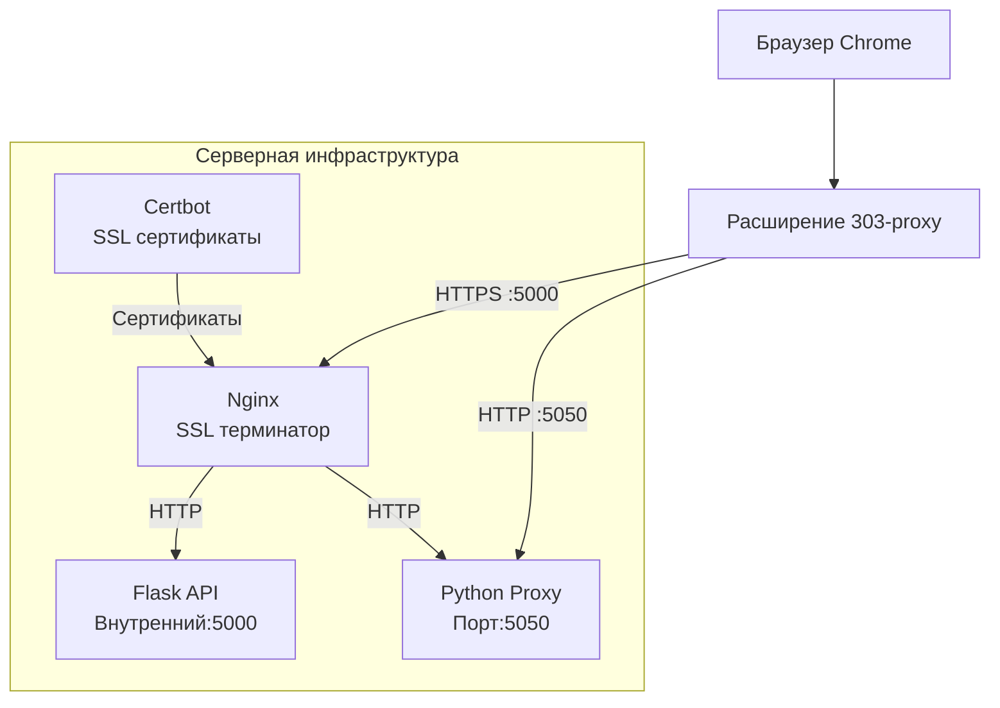

# 303-proxy - Полная техническая документация

## Архитектура системы



## Компоненты системы

### Серверная архитектура (Docker Compose)

**Файловая структура:**
```
├── docker-compose.yml          # Оркестрация контейнеров
├── nginx.conf                  # Основной конфиг Nginx с SSL
├── nginx_temp.conf             # Временный конфиг для получения сертификатов
├── switch-to-ssl.sh            # Скрипт переключения на SSL
├── letsencrypt/                # Сертификаты Let's Encrypt
├── ssl/                        # Копии сертификатов для Nginx
├── webroot/                    # ACME challenges для Certbot
├── flask_app/                  # Flask API приложение
│   ├── Dockerfile
│   ├── app.py
│   └── requirements.txt
└── proxy_server/               # Python прокси-сервер
    ├── Dockerfile
    ├── proxy_core.py
    └── requirements.txt
```

### Docker сервисы

```yaml
services:
  nginx:
    image: nginx:alpine
    ports: ["80:80", "443:443", "5000:5000"]
    # SSL терминатор, редиректы и балансировка

  certbot:
    image: certbot/certbot  
    # Автоматическое управление SSL сертификатами
    # Cron для автообновления

  proxy_logic:
    image: moiz303/proxy-core:1.0.5
    ports: ["5050:5050"]
    # Python прокси-сервер для туннелирования трафика

  flask_bridge:
    image: moiz303/proxy-flask:1.0.5  
    # Flask API для управления подключениями
```

## Сетевые порты и протоколы

### Внешние порты
| Порт | Протокол | Назначение |
|------|----------|------------|
| 80 | HTTP | Редирект на HTTPS |
| 443 | HTTPS | Редирект на порт 5000 |
| 5000 | HTTPS | Основное API (`/api/connect`, `/api/disconnect`) |
| 5050 | HTTP | Прокси-сервер для туннелирования трафика |

### Внутренние порты (Docker сеть)
- `flask_bridge:5000` - Flask API
- `proxy_logic:5050` - Python прокси

## Процесс работы

### 1. Получение SSL сертификатов
```bash
# Запуск с временной конфигурацией
docker-compose up -d

# Certbot автоматически получает сертификаты для 72-56-72-131.nip.io
# Переключение на постоянную SSL конфигурацию
./switch-to-ssl.sh
```

### 2. Подключение клиента
```
1. Браузер → HTTPS:5000/api/connect → Авторизация
2. Расширение → Настройка системного прокси на HTTP:5050  
3. Весь трафик → HTTP:5050 → Python прокси → Интернет
```

### 3. Автоматическое обслуживание
- **Certbot** обновляет сертификаты через cron
- **Nginx** автоматически перезагружает конфигурацию
- **Docker** обеспечивает изоляцию и восстановление сервисов

## Конфигурация Nginx

### Основной конфиг (nginx.conf)
```nginx
server {
    listen 80;
    server_name 72-56-72-131.nip.io;
    return 301 https://$server_name:5000$request_uri;
}

server {
    listen 443 ssl;
    server_name 72-56-72-131.nip.io;
    return 301 https://$server_name:5000$request_uri;
}

server {
    listen 5000 ssl;
    server_name 72-56-72-131.nip.io;
    
    ssl_certificate /etc/ssl/certs/nginx.crt;
    ssl_certificate_key /etc/ssl/certs/nginx.key;
    
    location /api/ {
        proxy_pass http://flask_bridge;
    }
}
```

### Временный конфиг для Certbot (nginx_temp.conf)
```nginx
server {
    listen 80;
    server_name 72-56-72-131.nip.io;
    
    location /.well-known/acme-challenge/ {
        root /var/www/certbot;
        try_files $uri =404;
    }
    
    location /api/ {
        proxy_pass http://flask_bridge;
    }
}
```

## Python прокси-сервер

### Архитектура прокси
```python
async def handle_client_proxy(reader, writer):
    # Чтение HTTP/HTTPS запроса
    # Определение типа запроса (CONNECT для HTTPS, обычный для HTTP)
    # Установка туннеля или прямое проксирование
    # Двусторонняя пересылка данных
```

### Поддерживаемые протоколы
- **HTTP** - прямое проксирование запросов
- **HTTPS** - туннелирование через CONNECT метод
- **WebSocket** - поддержка через туннелирование

## Управление SSL сертификатами

### Certbot автоматизация
```bash
# Ежедневная проверка и обновление
0 3 * * * certbot renew --webroot -w /var/www/certbot --post-hook \
  "cp /etc/letsencrypt/live/72-56-72-131.nip.io/fullchain.pem /ssl/nginx.crt \
   && cp /etc/letsencrypt/live/72-56-72-131.nip.io/privkey.pem /ssl/nginx.key \
   && echo reload"
```

### Резервные сертификаты
- При невозможности получения сертификатов Let's Encrypt
- Автоматическое создание self-signed сертификатов
- Прозрачное переключение между типами сертификатов

## Развёртывание и обслуживание

### Первоначальная установка
```bash
# Клонирование и настройка
git clone <repository>
cd 303-proxy

# Создание необходимых папок
mkdir -p letsencrypt ssl webroot
chmod 755 letsencrypt ssl webroot

# Запуск системы
docker-compose up -d

# Мониторинг получения сертификатов
docker-compose logs -f certbot

# Переключение на SSL (после успешного получения сертификатов)
./switch-to-ssl.sh
```

### Ежедневное обслуживание
```bash
# Проверка статуса сервисов
docker-compose ps

# Просмотр логов
docker-compose logs -f nginx
docker-compose logs -f proxy_logic

# Проверка SSL сертификатов
openssl x509 -in ssl/nginx.crt -noout -dates
```

### Обновление системы
```bash
# Обновление отдельных сервисов
docker-compose pull
docker-compose up -d

# Пересоздание конкретного сервиса
docker-compose up -d --force-recreate proxy_logic
```

## Мониторинг и диагностика

### Ключевые метрики
- Статус Docker контейнеров
- Срок действия SSL сертификатов  
- Доступность портов 5050 и 5000
- Логи ошибок Nginx и Python приложений

### Команды диагностики
```bash
# Проверка сетевых портов
sudo netstat -tulpn | grep -E ':(5000|5050)'

# Тестирование прокси
curl -x http://72.56.72.131:5050 https://httpbin.org/ip

# Проверка SSL
curl -I https://72-56-72-131.nip.io:5000/api/connect

# Анализ логов
docker-compose logs --tail=100 nginx
```

## Безопасность

### Меры защиты
- **HTTPS везде** - все внешние подключения шифруются
- **Docker изоляция** - сервисы работают в изолированных контейнерах
- **Автоматические обновления** - поддержка актуальных SSL сертификатов
- **Firewall рекомендации** - только необходимые порты открыты наружу

### Рекомендации по безопасности
- Регулярное обновление базовых образов Docker
- Мониторинг сроков действия SSL сертификатов
- Резервное копирование конфигураций и сертификатов
- Использование сложных паролей для API endpoints

## Устранение неисправностей

### Частые проблемы и решения

**Проблема:** `ERR_PROXY_CONNECTION_FAILED`
```bash
# Решение: Проверить доступность порта 5050
docker-compose ps proxy_logic
sudo netstat -tulpn | grep :5050
```

**Проблема:** SSL сертификаты не обновляются
```bash
# Решение: Проверить логи Certbot
docker-compose logs certbot
# Принудительное обновление
docker-compose exec certbot certbot renew --force-renewal
```

**Проблема:** Nginx не запускается
```bash
# Решение: Проверить синтаксис конфига
docker-compose exec nginx nginx -t
# Проверить наличие сертификатов
ls -la ssl/
```

## Производительность и масштабирование

### Оптимизации
- Nginx как SSL терминатор снижает нагрузку на Python приложения
- Асинхронная обработка в Python прокси
- Docker resource limits для контроля использования ресурсов
- Кэширование SSL сессий в Nginx

### Мониторинг производительности
```bash
# Использование ресурсов контейнеров
docker stats

# Логи производительности Nginx
docker-compose logs nginx | grep -i "worker"
```

Эта документация описывает полную архитектуру системы 303-proxy, обеспечивающую безопасное и надёжное проксирование трафика через современную инфраструктуру на основе Docker, Nginx и автоматизированного управления SSL сертификатами.